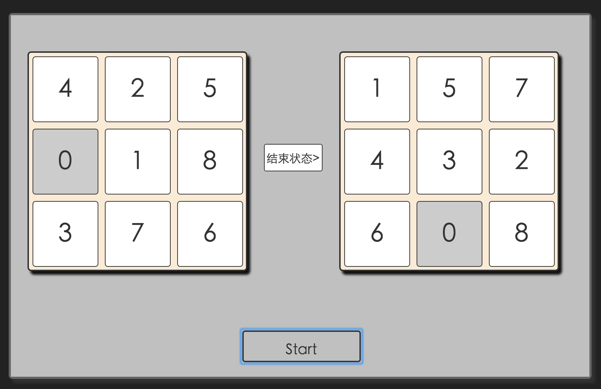
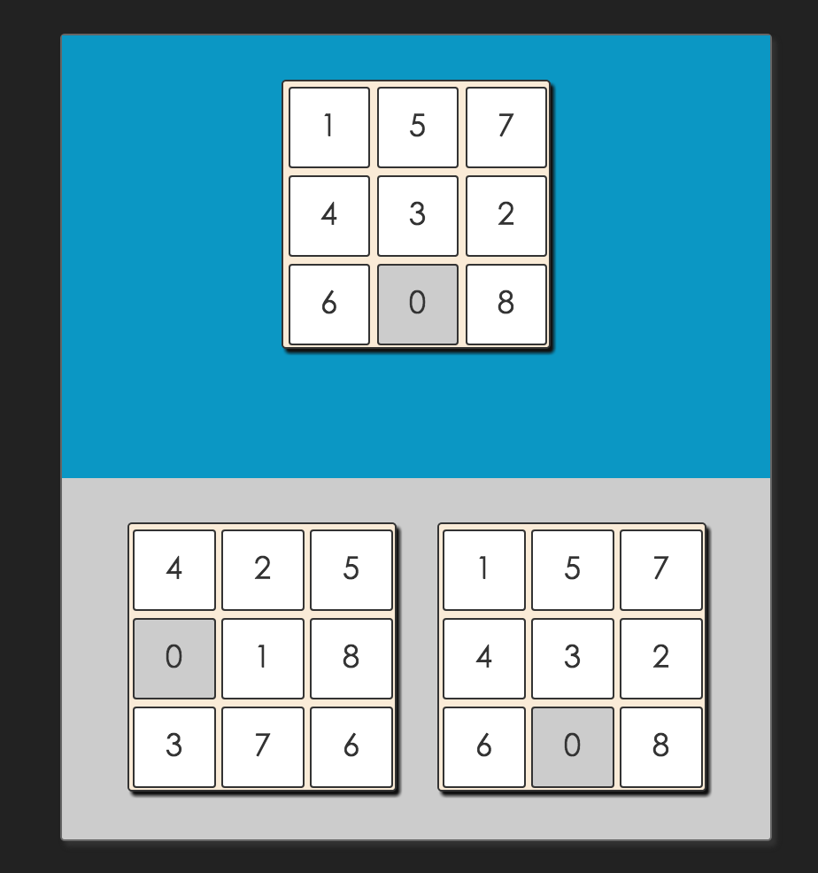

## 介绍

人工智能的作业, 启发式算法

采用的技术栈:

React.js

Node.js

Javascript

## 界面




## 运行

```shell
> git clone https://github.com/blackcater/EightPuzzle.git # 拷贝项目

> cd ./EightPuzzle-master

> npm run serve # 启动react客户端

> cd ./server # 在另一个命令行中

> npm start # 启动express服务器
```
